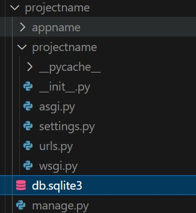
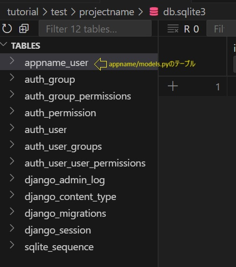
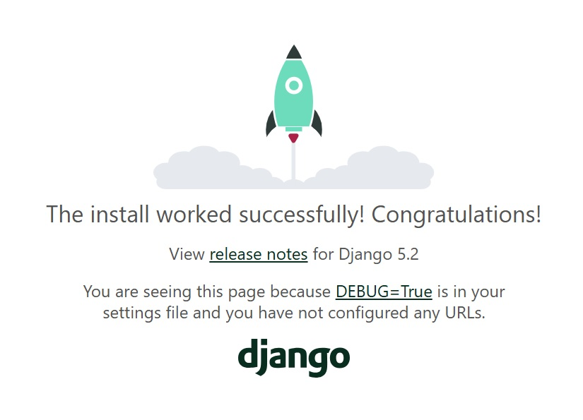
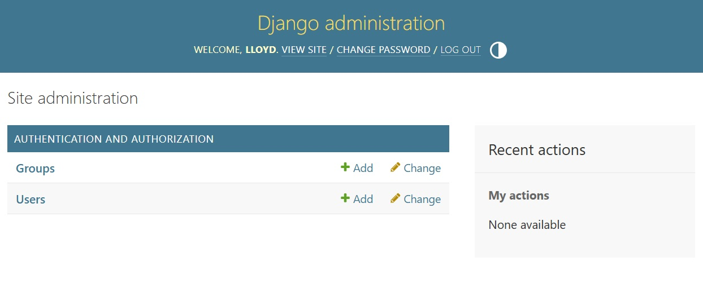

## 1.0 Django入門：セットアップ編

### 1.1 環境
- VS Codeを使用。PyCharmでは、特にインストールに関してやり方異なる。Djangoに関する説明は基本Editor/IDEに関係なく、両方同じ。
- Linux系のOS
- Python v3.10
- Django v5.1

### 1.2 インストール
```python
# プロジェクトフォルダ作成
mkdir project && cd project

# 仮想環境
python -m venv .venv
source .venv/bin/activate

# djangoをインストール
pip install django

# インストール確認
django-admin --version

```


### 1.3 プロジェクトとアプリの作成
簡単なアプリを作成する。Djangoは１つプロジェクトで複数のapp入れる方式のFW。最初```startproject```でプロジェクト作成、それから必要に応じて```startapp```でどんどんappを追加していく。DBもあるので、必ずDB移行コマンド```makemigrations```と```migrate```してから、```runserver```でサーバーを立ち上げる。

#### 1.3.1 プロジェクト作成
```python
# インストール問題なければ、プロジェクト作成. この例では、projectnameという名で作成します。
django-admin startproject projectname
```
生成したプロジェクトファイル：
```
projectname/             # 任意の名前、一般的にはdjangoのプロジェクト名と同じ
│
├── projectname/         # Djangoのプロジェクト名
│   ├── __init__.py      
│   ├── asgi.py          # 非同期サーバーゲートウェイインタフェース
│   ├── settings.py      # 設定ファイル
│   ├── urls.py          # URL宣言
│   └── wsgi.py          # 同期サーバーゲートウェイインタフェース
│
├── manage.py            # DjangoのCLI
│
└── .venv/               # 仮想環境
```
- asgiとwsgiは、デプロイの時に使う。ほとんど編集する必要がない。（編集必要の例：middlewareやwebsocketを使う）
- settings.pyは、DB、メディアフォルダ、セキュリティなど、アプリを設定する
- urls.pyはアプリのurl pathを設定するファイル。Reactで言うとrouteのpathname。ブラウザ上のurlのpathを指定する。

#### 1.3.2　アプリ追加
```python
python manage.py startapp appname
```
生成されたアプリのフォルダとそのファイル：
```
appname/
├── migrations/ 　　# DB 操作
├── __init__.py
├── admin.py　　　　# モデル（DB）登録用
├── apps.py        # アプリ名定義、pytorchのモデルloadもここで行う
├── models.py      # DB のテーブル（schemaなど）定義
├── tests.py       # テストコード
└── views.py       # HTTPリクエストやAPIに返すデータを定義
```
- 次はDB移行説明があるため、例としてDBに画像登録用のテーブルを作成する。```appname/models.py```にテーブルの```class```を書く

```python
# .../appname/models.py
from django.db import models

class Image(models.Model):
    image_name = models.CharField(max_length=50)
    image_path = models.CharField(max_length=200)
    created_at = models.DateTimeField(auto_now_add=True)
    updated_at = models.DateTimeField(auto_now=True)

```
- ```django.db```の```models```で、DBテーブルの型などを指定。```DateTimeField```には、```auto_now_add```でレコード作成時の時刻を記録、```auto_now```で更新時刻を記録。<a href="https://docs.djangoproject.com/en/5.2/ref/models/fields/#datetimefield">参照ページ</a>

生成したアプリをプロジェクトに追加する必要がある
```python
INSTALLED_APPS = [
    "django.contrib.admin",
    "django.contrib.auth",
    "django.contrib.contenttypes",
    "django.contrib.sessions",
    "django.contrib.messages",
    "django.contrib.staticfiles",
    "appname", # <---ここに追加
]
```

#### 1.3.3 DB 移行
新しいテーブルを作成や、既存テーブルの編集など、DBになにか変更したあとDBの移行が必要。Djangoでは、DBを編集するためのコードを生成するコマンド```makemigrations```と、それを実行するコマンド```migrate```でDBを最新状態に更新する。
```
python manage.py makemigrations
python manage.py migrate
```
- これを実行すると、rootフォルダにDBの```db.sqlite3```ファイルが作られる。

<p align="center">
  
</p>

- DBの種類などの設定は、プロジェクトフォルダにある```settings.py```で変えられる。デフォルトはsqliteで、dbファイル名はdb.sqlite3。

```python
# .../projectname/settings.py
# ...
DATABASES = {
    'default': {
        'ENGINE': 'django.db.backends.sqlite3',
        'NAME': BASE_DIR / 'db.sqlite3',
    }
}
# ...
```
- 生成されたdb.sqlite3の中身を確認すれば、```appname/models.py```に定義されたテーブルも作成された。
<p align="center">
  
</p>

- これらのテーブルはdjangoのbuilt-inアプリで使うもので、```projectname/settings.py```の中にある```INSTALLED_APPS```で指定されている。

```python
# ...
INSTALLED_APPS = [
    'django.contrib.admin',
    'django.contrib.auth',
    'django.contrib.contenttypes',
    'django.contrib.sessions',
    'django.contrib.messages',
    'django.contrib.staticfiles',
    'appname',
]
# ...
```
- ほとんどのWebアプリケーションは、何らかのユーザー管理や承認処理が必要。自ら作成する手間を省くため、Djangoは標準で含まれている。

#### 1.3.4 Djangoサーバーを立ち上げる
- 下記のコマンドでサーバーを立ち上げる
```python
python manage.py runserver 0.0.0.0:3030 
# 0.0.0.0はネットワーク上で公開の指定、 3030は適当なポート番号（3000～65535）
```

- http://localhost:3030 にアクセスし、立ち上がったページを確認できる
<p align="center">
  
</p>

#### 1.3.5 Superuser（管理者）作成と管理画面
一回立ち上がったサーバーを切り、ターミナルに下記のコマンドで```superuser```を作成。パスワードの入力は必須。
```
python manage.py createsuperuser
```
再度サーバーを立ち上げ、http://localhost:3030/admin にアクセス。ユーザー名とパスワードを入力して、ログイン。管理画面が表示される。ここで、DBの閲覧や編集などができる。

<p align="center">
  
</p>


<span style="color:orange">画面に```appname/models.py```で作成したImageがない？！</span>
- 落ち着いてください。これは、```appname/admin.py```に登録していないからだ。

```python
# .../appname/admin.py
from django.contrib import admin
from .models import Image

admin.site.register(Image) # models.pyのImageテーブル登録

```

- これで管理画面に```appname/models.py```のImageが反映される

基本セットアップの手順は以上。

[>> 次：簡単アプリ作成](chap2-simple-app.md)


