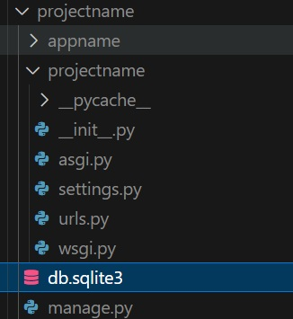
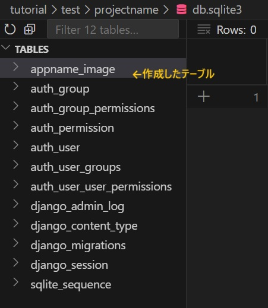

## Django入門

### 1.0 環境
- VS Codeを使用。PyCharmでは、特にインストールに関してやり方異なる。Djangoに関する説明は基本Editor/IDEに関係なく、両方同じ。
- Linux系のOS（Windowsは
- Python v3.10
- Django v5.2

### 1.1 インストール
```python
# プロジェクトフォルダ作成
mkdir project && cd project

# 仮想環境
python -m venv .venv
source .venv/bin/activate

# djangoをインストール
pip install django

# インストール確認
django-admin --version

```


### 1.2 プロジェクトとアプリの作成
簡単なアプリを作成する。Djangoは１つプロジェクトで複数のapp入れる方式のFW。最初```startproject```でプロジェクト作成、それから必要に応じて```startapp```でどんどんappを追加していく。DBもあるので、必ずDB移行コマンド```makemigrations```と```migrate```してから、```runserver```でサーバーを立ち上げる。

#### 1.2.1 プロジェクト作成
```python
# インストール問題なければ、プロジェクト作成. この例では、projectnameという名で作成します。
django-admin startproject projectname
```
生成したプロジェクトファイル：
```
projectname/             # 任意の名前、一般的にはdjangoのプロジェクト名と同じ
│
├── projectname/         # Djangoのプロジェクト名
│   ├── __init__.py      
│   ├── asgi.py          # 非同期サーバーゲートウェイインタフェース
│   ├── settings.py      # 設定ファイル
│   ├── urls.py          # URL宣言
│   └── wsgi.py          # 同期サーバーゲートウェイインタフェース
│
├── manage.py            # DjangoのCLI
│
└── .venv/               # Virtual environment
```
- asgiとwsgiは、デプロイの時に使う。ほとんど編集する必要がない。（編集必要の例：middlewareやwebsocketを使う）
- settings.pyは、DB、メディアフォルダ、セキュリティなど、アプリを設定する
- urls.pyはアプリのurl pathを設定するファイル。Reactで言うとrouteのpathname。ブラウザ上のurlのpathを指定する。

#### 1.2.2　アプリ追加
```python
python manage.py startapp appname
```
生成されたアプリのフォルダとそのファイル：
```
appname/
├── migrations/ 　　# DB 操作
├── __init__.py
├── admin.py　　　　# モデル（DB）登録用
├── apps.py        # アプリ名定義、pytorchのモデルloadもここで行う
├── models.py      # DB のテーブル（schemaなど）定義
├── tests.py       # テストコード
└── views.py       # HTTPリクエストやAPIに返すデータを定義
```
生成したアプリをプロジェクトに追加する必要がある
```python
INSTALLED_APPS = [
    "django.contrib.admin",
    "django.contrib.auth",
    "django.contrib.contenttypes",
    "django.contrib.sessions",
    "django.contrib.messages",
    "django.contrib.staticfiles",
    "appname", # <---ここに追加
]
```
#### 1.2.3 DB 移行
新しいテーブルを作成や、既存テーブルの編集など、DBになにか変更したあとDBの移行が必要。Djangoでは、DBを編集するためのコードを生成するコマンド```makemigrations```と、それを実行するコマンド```migrate```でDBを最新状態に更新する。
```
python manage.py makemigrations
python manage.py migrate
```
- これを実行すると、rootフォルダにDBの```db.sqlite3```ファイルが作られる。

<p align="center">
  
</p>

- DBの種類などの設定は、プロジェクトフォルダにある```settings.py```で変えられる。デフォルトはsqliteで、dbファイル名はdb.sqlite3。

```python
# projectname/settings.py
# ...
DATABASES = {
    'default': {
        'ENGINE': 'django.db.backends.sqlite3',
        'NAME': BASE_DIR / 'db.sqlite3',
    }
}
# ...
```
- 生成されたdb.sqlite3の中身を確認すれば、```appname/models.py```に定義されたテーブルも作成された。
<p align="center">
  
</p>

- これらのテーブルはdjangoのbuilt-inアプリで使うもので、```projectname/settings.py```の中にある```INSTALLED_APPS```で指定されている。

```python
# ...
INSTALLED_APPS = [
    'django.contrib.admin',
    'django.contrib.auth',
    'django.contrib.contenttypes',
    'django.contrib.sessions',
    'django.contrib.messages',
    'django.contrib.staticfiles',
    'appname',
]
# ...
```
- ほとんどのWebアプリケーションは、何らかのユーザー管理や承認処理が必要。自ら作成する手間を省くため、Djangoは標準で含まれている。

#### 1.2.4 Djangoサーバーを立ち上げる
- 下記のコマンドでサーバーを立ち上げる
```python
python manage.py runserver 0.0.0.0:3030 
# 0.0.0.0はネットワーク上で公開の指定、 3030は適当なポート番号（3000～65535）
```

- http://localhost:3030 にアクセスし、立ち上がったページを確認できる

DjangoのコンセプトはModel, View, Templete. ModelはDB、Viewでデータを処理や出力、Templateは表示のやり方。

